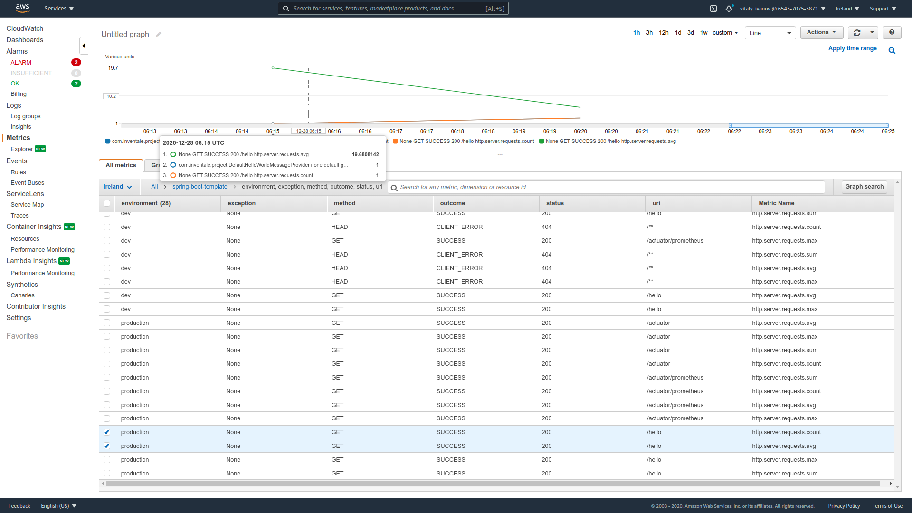

This project is a template for typical Spring Boot + Gradle case.

### Modules

1) buildSrc - Gradle dependencies and plugins configuration
2) model - contains only data classes
3) common - most common classes for all other modules.
4) backend - microservice business logic without Spring dependency 
5) backend-app - endpoints and DI configuration for backend module


### How to start

1) Enable Lombock support in your IDE, see https://gitlab.inventale.com/platform/spring-boot-template/wikis/Enable-Lombock-in-Idea for details
1) Run `com.inventale.project.HelloWorldApplication`
2) Try it: `curl localhost:8090/hello -v`

### PMD plugin

pdm plugin uses for check java code: https://docs.gradle.org/current/userguide/pmd_plugin.html
`gradle check` It runs tests and can fails build.
We can run its by `gradle pmdMain`

PMD: https://pmd.github.io/pmd-6.28.0/

### Profiles

We use [Spring profiles](https://docs.spring.io/spring-boot/docs/current/reference/html/spring-boot-features.html#boot-features-profiles)
to deal with environment-specific configurations.
Most common properties are located in the `/config` directory.
Each application can have its own properties in the `resources` path.

### Secret properties

Secret properties can be placed in `local` profile which is active by default
You should copy `config/application-local.yml.template` to `config/application-local.yml`
and specify needed properties.

This file is in gitignore, so the data will be on your local copy only.

### Wrap logs in json format

Sometimes it can be useful to write logs in `json` format, e.g. if you monitor your logs with help of `Kibana`, `CloudWatch`.
`json` format helps to watch logs correctly and use some alerting / monitoring based on logs. 

Logs are recorded if Spring `json-logs` profile is active (by default `json-logs` is included in `production` profile).
`json` logs are built with help of [`LogstashEncoder`](https://github.com/logstash/logstash-logback-encoder)   

### Log request and responses

[Logbook](https://github.com/zalando/logbook) is used to log HTTP requests and responses.

You can configure a format of logs and specify conditions when to log. Secret values can be hidden as well.

For example for `json-logs` profile we use JSON formatting, 
for `production` we log requests only in case of error to improve performance.

Example of logs:
HTTP:
```
Request:
26-02-2021 10:12:29.356 [http-nio-8090-exec-1] TRACE org.zalando.logbook.Logbook.write - Incoming Request: e91c54ce8c8a66ad
Remote: 127.0.0.1
GET http://localhost:8090/hello HTTP/1.1
accept: */*
host: localhost:8090
user-agent: curl/7.71.1

Response:
26-02-2021 10:12:29.453 [http-nio-8090-exec-1] TRACE org.zalando.logbook.Logbook.write - Outgoing Response: e91c54ce8c8a66ad
Duration: 147 ms
HTTP/1.1 200 OK
Content-Type: application/json
Date: Fri, 26 Feb 2021 06:12:29 GMT
Transfer-Encoding: chunked

{"message":"Hello world, Developer, current time [2021-02-26T06:12:29.401393Z]"}
```
JSON:
```
Request:
{
   "time":"2021-02-26T10:10:33.450+04:00",
   "message":"GET http://localhost:8090/hello",
   "logger_name":"org.zalando.logbook.Logbook",
   "thread_name":"http-nio-8090-exec-1",
   "level":"TRACE",
   "http":{
      "origin":"remote",
      "type":"request",
      "correlation":"c5098663549ef5ae",
      "protocol":"HTTP/1.1",
      "remote":"127.0.0.1",
      "method":"GET",
      "uri":"http://localhost:8090/hello",
      "headers":{
         "accept":[
            "*/*"
         ],
         "host":[
            "localhost:8090"
         ],
         "user-agent":[
            "curl/7.71.1"
         ]
      }
   }
}

Response:
{
   "time":"2021-02-26T10:10:33.542+04:00",
   "message":"200 OK GET http://localhost:8090/hello",
   "logger_name":"org.zalando.logbook.Logbook",
   "thread_name":"http-nio-8090-exec-1",
   "level":"TRACE",
   "http":{
      "origin":"local",
      "type":"response",
      "correlation":"c5098663549ef5ae",
      "duration":159,
      "protocol":"HTTP/1.1",
      "status":200,
      "headers":{
         "Content-Type":[
            "application/json"
         ],
         "Date":[
            "Fri, 26 Feb 2021 06:10:33 GMT"
         ],
         "Transfer-Encoding":[
            "chunked"
         ]
      },
      "body":{
         "message":"Hello world, Developer, current time [2021-02-26T06:10:33.490274Z]"
      }
   }
}
```


### Use cases
* Build project: `./gradlew clean build`

* You can see all outdated dependencies using the command `./gradlew dependencyUpdates`

* You can see information about build and tests `./gradlew clean test --scan`

* Spring boot has built-in tools to get meta information about your application
called [Spring Boot Actuator](https://docs.spring.io/spring-boot/docs/current/reference/html/production-ready-features.html)
You can find it after application starts: `http://localhost:8090/actuator/`

* To change active profiles, you can change the value of the `spring.profiles.active` property in `config/application.yml`
or override this property by environment one. See order and other helpful information in the article https://docs.spring.io/spring-boot/docs/1.2.2.RELEASE/reference/html/boot-features-external-config.html.

### Dependency check

We use `owasp` for check dependencies by the plugin `org.owasp.dependencycheck`.
See `id(Plugins.owasp)` in `build.gradle.kts`. Runs by `./gradlew dependencyCheckAnalyze` in `.gitlab-ci.yml`

### Task tree
Optional plugin shows tasks, which will be executed at calling another task. It can help with debugging tasks dependencies while creating your task or optimizing time spent on checks

Example usage: `./gradlew build taskTree --task-depth 3`  
Output will be like:
```
> Task :sdk:taskTree

------------------------------------------------------------
Project :sdk
------------------------------------------------------------

:sdk:build
+--- :sdk:assemble
|    +--- :sdk:assembleDebug
|    |    +--- :sdk:bundleDebugAar ..>
|    +--- :sdk:assembleRelease
|    |    +--- :sdk:bundleReleaseAar ..>
|    +--- :sdk:compileKotlinLinux
|    +--- :sdk:compileKotlinMacos
|    +--- :sdk:compileKotlinMingw
|    +--- :sdk:metadataJar
|    +--- :sdk:mingwMetadataJar
|    \--- :sdk:sourcesJar
\--- :sdk:check
     +--- :sdk:allTests
     |    +--- :sdk:jvmTest ..>
     |    +--- :sdk:linuxTest ..>
     |    +--- :sdk:macosTest ..>
     |    \--- :sdk:mingwTest ..>
     +--- :sdk:ktlintCommonMainSourceSetCheck
     +--- :sdk:ktlintMingwTestSourceSetCheck
     +--- :sdk:lint
     |    +--- :sdk:prepareLintJar
     |    +--- :sdk:processDebugManifest ..>
     |    \--- :sdk:processReleaseManifest ..>
     \--- :sdk:test
          +--- :sdk:testDebugUnitTest ..>
          \--- :sdk:testReleaseUnitTest ..>


(..>) - subtree omitted (exceeds task-depth)
```

More examples you can find at plugin's [homepage](https://github.com/dorongold/gradle-task-tree)

### Prometheus metrics

All exported by application business metrics are declared in `com.inventale.project.metrics.PrometheusMetrics`
HTTP endpoints metrics are exported by default with name `http_server_requests_seconds` 

After the application starts, you can check them here:
* List of all available metrics: `http://localhost:8090/actuator/metrics`
* Metrics page for Prometheus: `http://localhost:8090/actuator/prometheus`


Please note that metrics will appear only after the first call of `/hello` endpoint.

If you want to add `@Timed` annotation please note that it works only for classes but not for interfaces. 

Please pay attention on `com.inventale.project.HelloWorldService.getHelloWorld`.
Here you can find an example of usage of the counter `hello_world_count` and the gauge `hello_world_letters_number`

An example of usage of `@Timed` annotation can be found in `com.inventale.project.DefaultHelloWorldMessageProvider`,
`com.inventale.project.DevHelloWorldMessageProvider` and `com.inventale.project.controller.HelloWorldController`.

This annotation requires the `io.micrometer.core.aop.TimedAspect` bean defined in your Spring configuration.

JVM metrics like memory usage and CPU utilization are exported by default.

### Cloudwatch metrics

All metrics described in the previous chapter are exported to AWS CloudWatch as well for non-local environments 
via `io.micrometer:micrometer-registry-cloudwatch` and `org.springframework.cloud:spring-cloud` autoconfigs.

You can find them here: `https://eu-west-1.console.aws.amazon.com/cloudwatch/home?region=eu-west-1#metrics` 
under the `spring-boot-template` namespace with inventale-dev AWS account.



For local profile spring cloud features are disabled in `com/inventale/project/LocalConfig.java`

### How to run application on AWS

1) Login to inventale-dev AWS account.
2) Navigate to instance https://eu-west-1.console.aws.amazon.com/ec2/v2/home?region=eu-west-1#InstanceDetails:instanceId=i-09ca0c1024757321d
3) Start Instance (Actions -> Start Instance)

If this instance has been deleted, you can your own with Amazon Machine Image with id `ami-08dd8b0ac2036800e` and name `Spring Boot Template`.

Please see the article how to create eс2 instance from custom AMI https://aws.amazon.com/premiumsupport/knowledge-center/launch-instance-custom-ami/ 

This AMI is available only in Ireland on inventale-dev account - nowhere else it will be available.

Service will be started on instance startup.

You can see these metrics in Prometheus UI -> ${PROMETHEUS_URL}/graph?g0.range_input=1h&g0.expr=hello_world_letters_number&g0.tab=1&g1.range_input=1h&g1.expr=hello_world_letters_number&g1.tab=1&g2.range_input=1h&g2.expr=hello_message_provider_timed_seconds_sum&g2.tab=1&g3.range_input=1h&g3.expr=http_server_requests_seconds_sum&g3.tab=1
Please take PROMETHEUS_URL CI Secret variables.
 
This link works only with Maxifier VPN.


Prometheus can be used as a datasource for Grafana. You can see a dashboard at Inventale grafana

